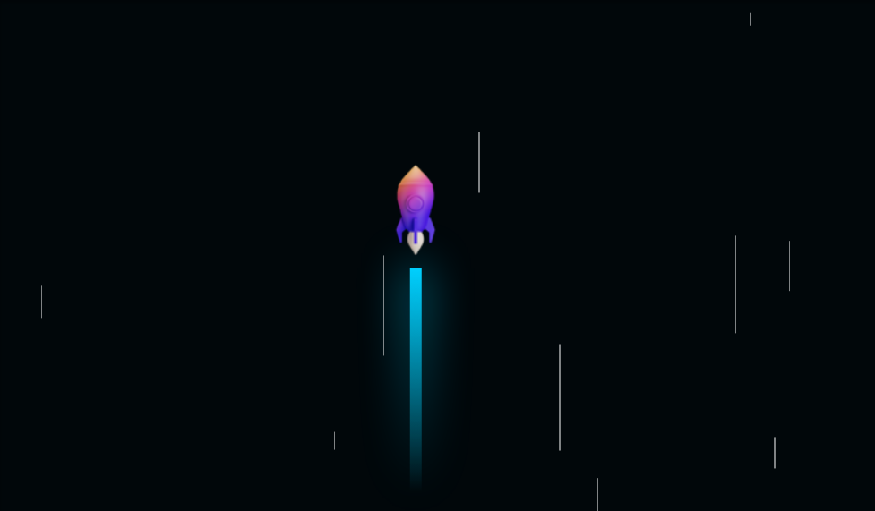

## 🖥️ Projeto
Esse é um projeto Web de um foguete utilizando animações CSS

## 🚀 Tecnologias
Esse projeto foi desenvolvido através de: 

- HTML
- CSS
- Git e Github

## 🏷️ Layout 
Você pode visualizar o layout do projeto através 
[desse link](https://www.figma.com/file/UwiuLOQY2KBS4283r47GK3/Animation-Rocket?type=design&node-id=0%3A1&t=ywVYDgpVqgPmGHZE-1).

É necessário ter uma conta no [Figma](https://www.figma.com)

